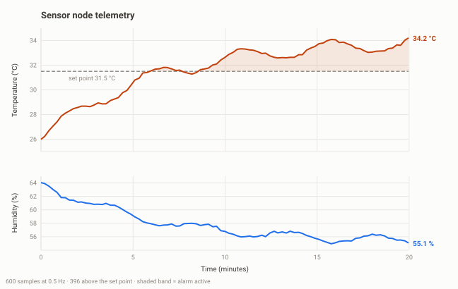

# Multi-Protocol Sensor Node (ESP32)

An instrumentation node that talks to the outside world four different ways at
once, and a small Python program on the laptop that logs and plots what it says.

**[Run it in your browser](https://wokwi.com/projects/475219333641877505)** on Wokwi, no hardware required.



| Interface | Used for | Pins |
|---|---|---|
| 1-Wire | DHT22 temperature and humidity sensor | GPIO 15 |
| I2C | 16x2 character LCD at address 0x27 | SDA 21, SCL 22 |
| ADC (12 bit) | potentiometer setting the alarm threshold | GPIO 34 |
| UART | CSV telemetry to the laptop at 115200 baud | USB |

## What it does

The node samples the sensor twice a second, smooths the reading, compares it
with a threshold the operator sets on a knob, lights an alarm LED when the
threshold is crossed, shows everything on the LCD, and streams one CSV line per
sample to the laptop. The Python side captures that stream to a file and turns
it into a chart.

That is the shape of almost every real data-acquisition system: sample, filter,
compare, indicate, transmit, record.

## Points worth understanding

**No `delay()` in the main loop.** A beginner sketch samples a sensor, calls
`delay(2000)` and does nothing else for two seconds. This firmware instead
stores the next time each job is due and checks the clock:

```cpp
if ((int32_t)(now - nextSensor) >= 0) { ... }
```

The subtraction and the cast to a signed type matter. `millis()` overflows back
to zero after about 49 days; comparing the *difference* rather than the absolute
values means the code keeps working through that rollover. Comparing
`now >= nextSensor` directly would freeze the node for 49 days.

**Filtering in firmware.** Raw sensor readings jitter, and a threshold
comparison on a jittery signal makes the alarm flicker on and off. An
exponential moving average fixes it in one line:

```cpp
output = output + alpha * (sample - output);
```

With `alpha = 0.3` the output moves 30 % of the way to each new sample. It needs
one variable rather than a buffer of past samples, which is why it is the filter
of choice on small microcontrollers.

**CSV as a wire format.** The firmware prints a header line and then plain
comma-separated numbers. Anything can read it: the Arduino serial plotter, this
Python script, Excel, MATLAB. Inventing a binary protocol here would buy nothing
and cost a debugging tool.

**The knob is the set point.** The ADC returns 0 to 4095, which is mapped onto
20 - 40 °C. Being able to change a control parameter without recompiling is a
habit worth forming early.

## Run it in the simulator

1. Open [wokwi.com](https://wokwi.com) and start a new **ESP32** project.
2. Paste [`firmware/sketch.ino`](firmware/sketch.ino) over the default sketch.
3. Paste [`diagram.json`](diagram.json) into the `diagram.json` tab.
4. Open the **Library Manager** panel and add the two libraries listed in
   [`firmware/libraries.txt`](firmware/libraries.txt).
5. Press play. Click the DHT22 in the diagram to drag its temperature up and
   down, and drag the potentiometer to move the alarm threshold.

## Run the laptop side

```bash
pip install -r requirements.txt

# no hardware yet? build the 20-minute sample run and plot it
python host/make_sample.py --out data/sample_run.csv
python host/plot_run.py data/sample_run.csv --out docs/telemetry.svg

# with a real board plugged in
python host/log_serial.py --port /dev/ttyUSB0 --out data/run1.csv
python host/plot_run.py data/run1.csv --out docs/run1.png
```

On Windows the port looks like `COM5`; the Arduino IDE shows which one under
Tools > Port.

## File layout

```
firmware/sketch.ino      the node firmware
firmware/libraries.txt   the two Arduino libraries it needs
diagram.json             the simulator circuit
host/log_serial.py       capture the serial stream to CSV
host/plot_run.py         turn a CSV into a chart
host/make_sample.py      generate a sample run without hardware
data/sample_run.csv      20 minutes of sample data (generated, not committed)
docs/telemetry.svg       the chart above
```

## Possible extensions

- Buffer samples in flash and send them in a batch, so a dropped USB cable does
  not lose the run
- Replace the UART link with MQTT over Wi-Fi and publish to a broker
- Add a second sensor on the same I2C bus and show that addressing, not extra
  wires, is what makes I2C scale
